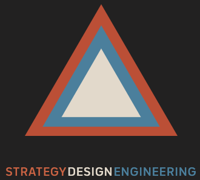

# GovStar
Life is too short to work for companies that have lost their fire.

*Our Purpose:* To build legendary teams that help unlock the future of U.S. Government

## What is a GovStar?
1. a government employee who achieves great things for the American public
1. a legendary consultant who dedicates their passion, talent, and expertise to unlock the future of U.S. government

Are you a GovStar? [We want to meet you.](mailto:tbd@govstar.us?subject=I%20am%20a%20GitHub%20GovStar)

## What We do
*We take a human centered design approach to everything we do:*

**Strategy**
- Organizational design, performance, and workplace transformation
- Portfolio and program management, executive coaching

**Design**
- Experience, service, and product design (UI, UX, EX)
- Digital storytelling and modern multimedia training

**Engineering**
- Prototype-driven application, cloud, and systems engineering
- Digital transformation and private lab services (AWS, Azure, Google)

 

## Find Out more
[Website](https://GovStar.us) |
[LinkedIn](https://www.linkedin.com/company/govstar) |
[Email Us](mailto:tbd@govstar.us?subject=GitHub%20is%20Awesome) 